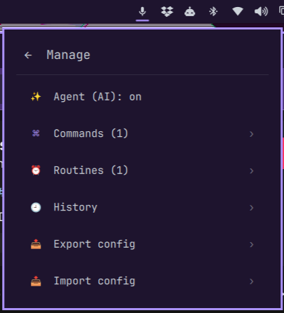

# Genesis



A voice-controlled AI agent for [Omarchy](https://omarchy.org/). Talk or type to
Genesis: it runs fast local commands itself (shutdown, volume, lights, TV, …)
and hands anything it doesn't recognize to your coding agent, which does the
task rather than answering it.

Genesis is a voice layer only — it reimplements nothing. Everything it executes
is delegated to tools Omarchy already ships (`omarchy-*` commands, the built-in
media service, `systemd` timers) or to plugins (Home Assistant, Roku, Apple TV),
with [Voxtype](https://voxtype.io/) for speech-to-text and your coding agent for
AI.

## Quick start

```bash
omarchy plugin add https://github.com/ronald2wing/Omarchy-Genesis.git --enable
```

This installs the plugin, starts its background service, and places a
microphone button in the bar (the manifest defaults it to the right section).
Click it to talk; right-click it for the popup menu. No config file is needed —
the defaults are sensible; copy `config.example.json` to
`~/.config/genesis/config.json` only if you want to customize.

This is the recommended **click-to-talk** setup. Leave the AI agent off (the
default) and skip the wake-word setup: fast and custom commands are deterministic
and fully offline. Read [AI agent](#ai-agent) and
[Wake word](#wake-word) before enabling either.

## Requirements

- **Omarchy 4 (Quattro)** with the Quickshell plugin system. Omarchy 3.x is not
  supported.
- **Voxtype** for speech-to-text: `omarchy voxtype install` (or Install → AI →
  Dictation in the Omarchy menu).
- **A default coding agent** for AI requests: `omarchy default agent claude`
  (also `codex`, `gemini`, `grok`, `opencode`, `copilot`, `crush`, `omp`, `pi`).
- **Home Assistant plugin** (optional, for device control):
  `omarchy plugin add https://github.com/konradk/hass.git --enable`.
- **Roku Remote** / **Apple TV Remote** (optional, for TV control).

Everything else ships with Omarchy — a recorder (`pw-record`, `parecord`, or
`arecord`), `jq`, and `python3`. The
wake word installs its own stack (`openwakeword`, `onnxruntime`, `sounddevice`)
into a private venv. Text-to-speech auto-detects `espeak-ng`/`espeak`/`spd-say`/
`flite` and is silent if none is installed.

## How it works

Every request flows through a fixed pipeline — `capture → transcribe → intent →
execute` — with each stage a standalone script in `bin/`. `Service.qml` only
orchestrates the stages and renders the overlay.

`bin/intent` decides what a request is, in order:

1. **Fast commands** — deterministic, offline, instant. See the tables below. No
   AI, no terminal.
2. **Custom commands** — phrases you (or another plugin) registered in the
   `commands` config.
3. **AI agent** — everything else goes to your default coding agent.

## Triggers

| Trigger | How |
|---------|-----|
| Tap to talk | Click the bar microphone, speak, and it stops and runs automatically |
| Menu | Right-click the microphone — a popup under the icon (type a command, or open Manage) |
| Wake word | Optional hands-free listening — skip it for click-to-talk; see below |
| Keyboard | Optional — add your own bind |

Listening starts and stops with a short beep (`audio.feedback: false` to mute).
Keybinds live in your own config:

```lua
o.bind("SUPER + F9", "Genesis", "omarchy-shell -q genesis toggle")
o.bind("SUPER + F8", "Genesis menu", "omarchy-shell shell toggle genesis '{}'")
o.bind("SUPER + F7", "Type a command", "~/.config/omarchy/plugins/genesis/bin/prompt")
```

`bin/prompt` is a lighter alternative to the menu: a bare text prompt (Walker, or
`gum` as a fallback) that submits the typed text as a command.

## Commands

Many phrasings map to each action; these are representative.

### System

| Say (examples) | Action |
|----------------|--------|
| "shut down the computer", "power off", "turn the computer off", "shut it down" | shutdown (confirm) |
| "reboot", "restart the computer", "reboot the system" | reboot (confirm) |
| "log out", "sign out", "log off", "sign me out" | logout (confirm) |
| "lock the screen", "lock my pc" | lock |
| "suspend", "put the computer to sleep", "go to sleep" | suspend (confirm) |
| "take a screenshot", "screen capture" | screenshot |
| "open firefox", "launch spotify", "run kitty" | open an app |
| "turn the volume up", "louder", "raise the volume" | volume up |
| "turn the volume down", "quieter", "mute" | volume down / mute |
| "brightness up", "brighter" | increase brightness |
| "brightness down", "dimmer" | decrease brightness |
| "play music", "pause the song", "next song", "previous track" | media playback |
| "remind me in 15 minutes to pick up Jack" | set a reminder |
| "toggle night light" | night light |
| "stay awake", "allow idle" | idle behavior |
| "power mode performance" | power profile |
| "go to workspace 3" | switch workspace |
| "set theme to Tokyo Night" | change theme |
| "battery status", "what time is it", "what's playing" | status (notification) |
| "say hello world" | speak aloud (TTS) |

### Smart home (delegated to the Home Assistant plugin)

Device control goes through the community `hass` plugin over IPC — Genesis keeps
no Home Assistant connection or token. Spoken names resolve to entity IDs via
the `homeAssistant.entities` alias map; only configured aliases resolve, so an
unknown device falls through to the AI agent.

| Say (examples) | Action |
|----------------|--------|
| "toggle the living room lights" | toggle a device |
| "turn on/off the bedroom lights" | toggle a device |
| "activate movie mode" | run a scene |

Aliases resolve by exact match, then substring, then word-subset (order-free) —
so "turn on the lights in the living room" resolves `living room lights`.
Fine-grained commands ("set the lights to 50%") are handed to the AI agent.

### TV (delegated to the Roku / Apple TV remotes)

Direct to device, no Home Assistant required. `tv.backend` selects `roku`,
`apple-tv`, or `auto` (default: whichever is installed, Roku first).

| Say (examples) | Action |
|----------------|--------|
| "turn on/off the tv", "tv on/off", "power off the tv" | power |
| "play/pause the tv" | playback |
| "tv home", "home screen" | home |
| "tv up/down/left/right/select/back" | navigation |

## AI agent

**Disabled by default.** Enabling it is a deliberate opt-in: requests the
commands don't match are handed to your default coding agent via
`omarchy-agent-prompt`, which launches the agent in its usual floating terminal
with **approval prompts bypassed** (`--permission-mode bypassPermissions`,
`--yolo`, `--allow-all`). That means anything the mic hears — a podcast, a
video, someone talking nearby — that doesn't match a rule becomes an
instruction an unrestricted agent will act on. Only enable this if you are
comfortable with that.

When enabled, every unmatched request still requires an **on-screen
confirmation** first: Genesis shows what it heard and only launches the agent
after you approve — a misheard or ambient phrase can't reach the agent silently.

To enable it, set `agent.enabled: true` in `config.json`. If no default agent is
set, Genesis notifies you to run `omarchy default agent claude`.

When enabled, Genesis also passes its built-in actions and your registered
custom commands to the agent as tools, so it can dynamically interpret a
request — "set the living room lights to 50 percent" — and invoke the matching
command with the arguments it extracts. The agent triggers a built-in action by
sending a phrase back through Genesis (`omarchy-shell -q genesis text
"<phrase>"`), which preserves confirmation for destructive actions.

```
"summarize this repo"        →  omarchy-agent-prompt "summarize this repo"
"write a script to backup…"  →  omarchy-agent-prompt "write a script to backup…"
```

## Custom commands & routines

Two user-extensible layers live in `config.json`: `commands` (phrase → plugin
IPC or shell command) and `routines` (schedule → command, run as systemd
timers). Both are created from the menu, the CLI, or by voice.

### Commands

```jsonc
"commands": {
  "focus-mode": { "phrase": "toggle do not disturb", "name": "Focus mode", "target": "notifications", "method": "toggleDnd" },
  "movie-night": { "phrase": "movie time", "name": "Movie night", "run": "omarchy-shell roku sendKey PowerOn && omarchy-shell hass activate scene.movie" },
  "check-disk-space": { "phrase": "check disk space", "run": "import shutil; print(shutil.disk_usage('/home').free // 2**30, 'GB free')", "lang": "python" }
}
```

Each entry is keyed by a stable id (a slug of the `name`, or the phrase), so the
phrase can change without losing the entry.

- `phrase` — the voice trigger that speech is matched against.
- `target` + `method` (+ optional `params`) — an `omarchy-shell` IPC call.
- `run` — a script in `lang` (default `bash`; also `python`, `node`, `ruby`).
- `name` (optional) — the display label shown in the menu.

### Routines

```jsonc
"routines": {
  "good-morning": { "schedule": "08:00", "name": "Good morning", "run": "omarchy-notification-send \"Good morning\" \"Rise and shine\"" },
  "evening-scene": { "schedule": "Mon-Fri 18:00", "run": "omarchy-shell hass activate scene.evening" },
  "stand-up": { "schedule": "17:00", "run": "console.log('Stand up and stretch')", "lang": "node" }
}
```

Schedule forms: `HH:MM` (daily), `Mon-Fri HH:MM` (weekdays), `Sun HH:MM`
(weekly), `Mon,Wed,Fri HH:MM` (specific days), or a full systemd `OnCalendar`
expression. `lang` defaults to `bash`; a non-bash routine's code is written to a
companion file and run by the matching interpreter. One-off runs (transient, not
persisted) are `routines once "5m" "…"` (after a delay — systemd time span) and
`routines at "15:00" "…"` (at a wallclock time — systemd `OnCalendar`). Both take
`--lang <bash|python|node|ruby>`.

### Managing

Create, edit, and remove commands and routines from the popup menu, the CLI,
or by voice:

1. **Popup menu** — right-click the microphone for a popup under the icon. Type
   a command (or hit 🎤 Voice to speak it), or open "Manage commands & routines"
   to add, edit, or remove entries, run one now (▶), toggle the AI agent, and
   review each entry's run history. The ✨ "Ask AI" buttons (on the lists and in
   the add forms) register a new command or routine — never just answer — and the
   ✨ "Ask AI to update" in an entry's edit form changes only that entry. Export
   and import config from the Manage screen.
2. **CLI** — `bin/commands {set,run,remove,list,export,import}` and
   `bin/routines {set,once,at,run,remove,install,list,export,import}`. `commands run`
   and `routines set`/`once`/`at` take an optional `--lang <bash|python|node|ruby>`;
   `routines run <schedule>` runs a routine's command immediately.
3. **Voice** — "add a command to …", "update my joke command", or "set a
   routine to …" hands the request to the coding agent, which calls the same
   CLIs. Existing entries are listed with their current definitions so the
   agent updates only the one you name; new entries get a short `--name`.

```bash
~/.config/omarchy/plugins/genesis/bin/commands set "movie time" media play
~/.config/omarchy/plugins/genesis/bin/commands run --lang python "check disk space" "import shutil; print(shutil.disk_usage('/home').free)"
~/.config/omarchy/plugins/genesis/bin/routines set "Mon-Fri 09:00" "omarchy-notification-send \"Focus\""
```

`commands export` / `routines export` write their section as JSON (to stdout or a
file); `commands import <file>` / `routines import <file>` merge a JSON object
back in (same-key entries are overwritten, importing routines also reinstalls
the timers). Add `--dry-run` (`routines import --dry-run <file>`, or
`config-import --dry-run '<json>'`) to preview what would be written and which
timers would be installed — nothing is changed.

### Failures

If a custom command or routine errors, Genesis notifies you and **blocks** it —
saying the phrase again won't run it until you fix it. The popup menu marks a
failed last run with ❌ (✅ on success); editing one clears the error and
unblocks it. Errors live in `~/.local/state/genesis/errors.json`; every action
is logged in `~/.local/state/genesis/log.json`.

## Wake word

**Skip this for click-to-talk.** The recommended setup doesn't need it — this is
an opt-in, always-listening trigger, and leaving it off keeps the microphone
from running continuously. Only set it up if you specifically want hands-free
use.

Optional hands-free trigger using [openWakeWord](https://github.com/dscripka/openWakeWord)
(MIT), a real keyword spotter. One-time setup, then start it (or add
`wake-word start` to your autostart):

```bash
~/.config/omarchy/plugins/genesis/bin/wake-word-setup
~/.config/omarchy/plugins/genesis/bin/wake-word start
```

Set `wakeWord.model` to any shipped phrase — the default is `hey_jarvis`:

| `wakeWord.model` | Detected phrase |
|------------------|-----------------|
| `hey_jarvis` | "hey jarvis" |
| `alexa` | "alexa" |
| `hey_mycroft` | "hey mycroft" |
| `hey_rhasspy` | "hey rhasspy" |

Tune sensitivity with `wakeWord.threshold` (default `0.5`). For a phrase
openWakeWord doesn't ship (e.g. "hey omarchy"), train a custom model once (see
the [training notebook](https://github.com/alfiedennen/openwakeword-colab-2026))
and point `wakeWord.model` at the resulting `.onnx` file.

## Confirmation

`shutdown`, `reboot`, `logout`, and `suspend` require confirmation: Genesis
shows a dialog and listens for a spoken "yes" for a few seconds. Click the
button or say "yes" to proceed; anything else cancels. Confirmation can only be
answered from the dialog itself — there is no IPC method that confirms
remotely.

## Configuration

`~/.config/genesis/config.json` (see `config.example.json` for a complete
example):

- `agent.enabled` — hand unmatched requests to the coding agent. Default
  `false`; see the AI agent section for the risk before enabling.
- `wakeWord.model` / `wakeWord.threshold` — wake-word model and sensitivity.
- `homeAssistant.entities` — spoken-name → entity-ID map (the token lives in the
  `hass` plugin, not here).
- `tv.backend` — `roku`, `apple-tv`, `auto`, or `off`.
- `commands` — id → `{ phrase, target, method, params }` (IPC) or
  `{ phrase, run, lang }` (script; `lang` defaults to `bash`), with an optional
  `name`.
- `routines` — id → `{ schedule, run, lang }` (+ optional `name`), installed as
  systemd timers.
- `audio.microphone` / `audio.feedback` — mic device and the listen beep.
- `confirmActions` — actions that require confirmation (default
  `shutdown reboot logout suspend`).

## For plugin authors

Genesis is a voice layer for any Quattro plugin. A registered command works two
ways: as a literal voice phrase, and as a tool the AI agent can invoke with
dynamically extracted arguments.

**1. Expose an IPC target** in your plugin:

```qml
IpcHandler {
  target: "myplugin"
  function toggleDoNotDisturb(): string { dnd = !dnd; return dnd ? "on" : "off" }
  function setLight(power: string): string { light.power = power; return "ok" }
}
```

**2. Tell users what to add to their Genesis config:**

```jsonc
"commands": {
  "toggle-dnd": { "phrase": "toggle do not disturb", "name": "Toggle DND", "target": "myplugin", "method": "toggleDoNotDisturb" },
  "key-light-on": { "phrase": "set the key light on", "target": "myplugin", "method": "setLight", "params": ["on"] }
}
```

Now "hey, toggle do not disturb" runs `omarchy-shell myplugin toggleDoNotDisturb`.
Genesis matches by phrase containment (longest phrase first, after its own
built-in commands), passes `params` as method arguments, and notifies the user
if your plugin isn't installed.

**3. Drive Genesis from your plugin** with
`omarchy-shell -q genesis <method>` (`begin`, `end`, `toggle`, `text <s>`,
`state`).

**4. Register commands and routines** by calling the same CLIs Genesis uses —
they write `config.json` atomically, so registrations persist and are
idempotent:

```bash
~/.config/omarchy/plugins/genesis/bin/commands set "toggle do not disturb" myplugin toggleDoNotDisturb
~/.config/omarchy/plugins/genesis/bin/routines set "08:00" "omarchy-shell myplugin refresh"
```

Removal is `commands remove "<phrase>"` and `routines remove "<schedule>"`.
Re-running `set`/`run` overwrites the same entry, so calling it on every load is
safe.

## Architecture

```
BarWidget.qml ──IPC──▶ omarchy-shell ──▶ Service.qml (service)
keybinds/wake-word ──IPC──▶                │  capture (pw-record)
                                           ▼
                                     bin/transcribe (voxtype)
                                           ▼
                                     bin/intent (rules → agent)
                                           ▼
              ┌────────────────────────────┴──────────────────────────────┐
              ▼                    ▼                                      ▼
     bin/execute (Omarchy)   omarchy-agent-prompt (AI)      plugins via IPC (hass/tv/…)
```

`Service.qml` is the always-running engine and renders the listening/confirmation
overlay. `BarWidget.qml` is a microphone button that drives it over IPC. `bin/`
holds the shell scripts for capture, transcription, intent matching, entity
resolution, and execution, so each stage stays testable on its own.

## Uninstall

```bash
~/.config/omarchy/plugins/genesis/bin/routines remove   # drop installed timers first
omarchy plugin remove genesis
```

## Development

```bash
bash tests/validate.sh      # manifest schema, bash -n, python syntax, JSON
bash tests/intent.sh        # intent + entity-resolution regression tests
bash tests/routine.sh       # one-off scheduling (once/at) arg construction
bash tests/config.sh        # command/routine export + import
```

On a Quattro machine also run `omarchy plugin validate .` and
`qmllint Service.qml BarWidget.qml`. See [SPEC.md](SPEC.md) for the behavior and
safety contract.
